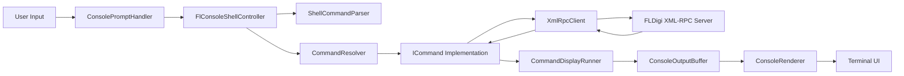

# flconsole

`flconsole` is an interactive console shell for controlling [FLDigi](https://www.w1hkj.org/) over XML-RPC.

It connects to an FLDigi instance (default `127.0.0.1:7362`), lets you call API methods directly, and provides higher-level convenience commands for common radio tasks.

## Important Warning

- Most of this codebase was written with AI assistance.
- Treat the implementation as reviewed but not infallible: verify behavior on your station setup before operational use.

## What It Does

- Sends XML-RPC requests to FLDigi and prints responses in a terminal UI.
- Provides command helpers for:
  - Generic XML-RPC method calls (`method`)
  - Frequency/mode/modem setup (`set`)
  - Continuous activity scanning by quality (`scan`)
  - RX text monitoring (`monitor`)
- Supports repeated commands with live incremental rendering in the console.

## Quick Start

Before starting `flconsole`, FLDigi must already be running and fully configured with XML-RPC enabled on the host/port you intend to use.

- Typical default endpoint is `127.0.0.1:7362`.
- In FLDigi, confirm XML-RPC is enabled and listening on the expected address/port.

Build from repository root:

```bash
dotnet build flconsole.sln
```

From repository root:

```bash
dotnet run
```

Show help:

```bash
dotnet run -- --help
```

Run with custom endpoint via config override (edit `flconsole/appsettings.json` first), then start:

```bash
dotnet run
```

Run a command immediately after startup:

```text
method system.listMethods
```

## Configuration

Default FLDigi endpoint settings:

- Host: `127.0.0.1`
- Port: `7362`

Config file:

- `flconsole/appsettings.json`

Example:

```json
{
  "FlConsole": {
    "Host": "127.0.0.1",
    "Port": 7362
  }
}
```

`Program` also supports loading an optional root `appsettings.json`.

## Commands

- `help`
  - Show available commands and examples.
- `quit`
  - Exit the shell.
- `method <method-name> [arg1 arg2 ...]`
  - Call any XML-RPC method directly.
- `set <frequency> <rig-mode> <modem-name>`
  - Take rig control, set frequency/mode, and set modem.
- `scan <lower-frequency> <upper-frequency> [step-hz] [quality-threshold]`
  - Repeatedly sweep a range and print activity above threshold.
  - Defaults:
    - `step-hz = 50`
    - `quality-threshold = 20`
  - Sweep repeat interval is 3 seconds, with a 250 ms settle delay after each frequency set.
- `monitor`
  - Poll `rx.get_data` once per second and print decoded RX text.

## Code Structure

## Architecture Flow



### Entry and Composition

- `flconsole/Program.cs`
  - Process entrypoint for the main app project.
  - Loads configuration and builds the dependency injection container.
- `flconsole/Dependencies.cs`
  - Registers services, commands, controller, renderer, and application.
- `flconsole/FlConsoleApplication.cs`
  - Main runtime flow:
    - Handles `--help`
    - Prints startup banner
    - Runs prompt/read/dispatch loop

### Command Layer

- `flconsole/Commands/ICommand.cs`
  - Command contract (`CommandName`, `Repeat`, `RepeatInterval`, `StopsShell`, `ExecuteAsync`).
- `flconsole/Commands/FlConsoleShellController.cs`
  - Parses input, resolves commands, starts/stops display loop, handles unknown commands.
- `flconsole/Commands/CommandDisplayRunner.cs`
  - Executes commands and renders stream output incrementally.
- `flconsole/Commands/ShellCommandParser.cs`
  - Tokenizes user input into command + args.
- `flconsole/Commands/CommandResolver.cs`
  - Name-to-command lookup.
- Concrete commands:
  - `flconsole/Commands/HelpCommand.cs`
  - `flconsole/Commands/QuitCommand.cs`
  - `flconsole/Commands/MethodCallCommand.cs`
  - `flconsole/Commands/SetCommand.cs`
  - `flconsole/Commands/ScanCommand.cs`
  - `flconsole/Commands/MonitorCommand.cs`

### Console UI Layer

- `flconsole/Console/ConsoleRenderer.cs`
  - Draws output area and prompt, wraps lines to window width.
- `flconsole/Console/ConsolePromptHandler.cs`
  - Interactive line editing (cursor movement, backspace/delete, escape clear, Ctrl+D EOF).
- `flconsole/Console/ConsoleOutputBuffer.cs`
  - Stores line and fragment output with max history.
- Abstractions:
  - `flconsole/Console/IRenderer.cs`
  - `flconsole/Console/IPromptReader.cs`
  - `flconsole/Console/IPromptState.cs`
  - `flconsole/Console/IConsoleFacade.cs`
  - `flconsole/Console/IConsoleInput.cs`

### XML-RPC Layer

- `flconsole/XmlRpcClient.cs`
  - HTTP XML-RPC transport to FLDigi.
- `flconsole/XmlRpcSerializer.cs`
  - Request serialization and response deserialization.
- `flconsole/Models/*`
  - XML-RPC object model (`XmlRpcRequest`, `XmlRpcResponse`, typed values, helpers).

### Root Runner Convenience Project

- `flconsole.run.csproj`
- `runner/Program.cs`

This small launcher project makes `dotnet run` work directly from the repository root by forwarding to:

```text
dotnet run --project flconsole/flconsole.csproj -- <args>
```

## Development

Build:

```bash
dotnet build flconsole.sln
```

Run tests:

```bash
dotnet test tests/flconsole.Tests/flconsole.Tests.csproj
```

Run from root (default launcher project):

```bash
dotnet run
```

Run main app project directly:

```bash
dotnet run --project flconsole/flconsole.csproj
```

## Notes

- Designed for terminal use with a running and configured FLDigi XML-RPC server.
- XML-RPC command behavior and available methods are determined by FLDigi.
