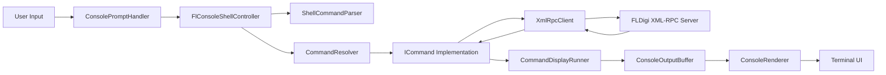

# flconsole

`flconsole` is an interactive console shell for controlling [FLDigi](https://www.w1hkj.org/) over XML-RPC.

It connects to an FLDigi instance (default `127.0.0.1:7362`), lets you call API methods directly, and provides higher-level convenience commands for common radio tasks.

## Important Warning

- Most of this codebase was written with AI assistance.
- Treat the implementation as reviewed but not infallible: verify behavior on your station setup before operational use.

## What It Does

- Sends XML-RPC requests to FLDigi and prints responses in a terminal UI.
- Provides command helpers for:
  - Generic XML-RPC method calls (`method`)
  - Frequency/mode/modem setup (`set`)
  - Continuous activity scanning by quality (`scan`)
  - RX text monitoring (`monitor`)
- Supports repeated commands with live incremental rendering in the console.

## Quick Start

Before starting `flconsole`, FLDigi must already be running and fully configured with XML-RPC enabled on the host/port you intend to use.

- Typical default endpoint is `127.0.0.1:7362`.
- In FLDigi, confirm XML-RPC is enabled and listening on the expected address/port.

Build from repository root:

```bash
dotnet build flconsole.sln
```

From repository root:

```bash
dotnet run
```

Show help:

```bash
dotnet run -- --help
```

Enable transmit-capable commands explicitly:

```bash
dotnet run -- --tx
```

Without `--tx`, commands marked as transmit-capable are not available. The flag is opt-in and has no effect on receive-only commands.

Run with custom endpoint via config override (edit `flconsole/appsettings.json` first), then start:

```bash
dotnet run
```

Run a command immediately after startup:

```text
clear
identify 5 5 v
```

When started with `--debug`, direct XML-RPC calls are also available:

```text
method system.listMethods
```

## Debug Mode

Start debug mode from the repository root with:

```bash
dotnet run -- --debug
```

The `--` passes the option to `flconsole` instead of to `dotnet run`. You can also run the application project directly:

```bash
dotnet run --project flconsole/flconsole.csproj -- --debug
```

Debug mode does two things:

- Enables the `method` command for direct XML-RPC calls.
- Adds carrier readback and quality output for every stop during `scan`.

The normal interactive commands are also available in debug mode:

```text
help
clear
quit
adjust <frequency>
set <frequency> [modem-name] [rig-mode]
scan [quality-threshold]
monitor
identify [all] [listen-seconds] [top-candidates] [v]
method <method-name> [arg1 arg2 ...]
```

### Debug Command Examples

Show the available commands without connecting to FLDigi:

```bash
dotnet run -- --debug --help
```

Inside the debug shell, call an XML-RPC method directly. Integer and decimal arguments are parsed as numbers; other arguments are sent as strings:

```text
method system.listMethods
method rig.get_frequency
method modem.set_carrier 1500
method modem.get_quality
```

Run a scan with per-carrier diagnostics. The optional value is the minimum quality threshold for reporting activity; it does not disable the debug lines:

```text
scan
scan 5
```

For verbose modem-candidate details, use `v` with `identify`. This is an `identify` argument and does not require starting the process with `--debug`:

```text
identify 5 5 v
identify all 5 5 v
```

`identify` arguments are positional: `all` tests every modem returned by FLDigi, the first number is the RSID listening time in seconds, the second number is the number of heuristic candidates to show, and `v` prints each candidate's scoring details. `method` is only registered when the application is started with `--debug`; in normal mode it is unavailable.

## Configuration

Default FLDigi endpoint settings:

- Host: `127.0.0.1`
- Port: `7362`

Config file:

- `flconsole/appsettings.json`
- Optional system-wide configuration: `/etc/flconsole.conf`

Configuration files use JSON format. The system-wide file is loaded first, so the repository and application-local files override matching settings.

Example:

```json
{
  "FlConsole": {
    "Host": "127.0.0.1",
    "Port": 7362,
    "ScanSettleDelayMilliseconds": 250
  }
}
```

Scan configuration:

- `ScanSettleDelayMilliseconds`
  - Delay after each `modem.set_carrier` step before reading quality.
  - Default: `250`.
- `IdentifyModems`
  - Ordered modem list used by `identify` when `all` is not specified.
  - `identify all ...` overrides this and tests every modem returned by FLDigi.

`Program` also supports loading an optional root `appsettings.json`.

## Commands

- `clear`
  - Clear the console output area and keep the shell running.
- `help`
  - Show available commands and examples.
- `quit`
  - Exit the shell.
- `method <method-name> [arg1 arg2 ...]`
  - Call any XML-RPC method directly.
- `identify [all] [listen-seconds] [top-candidates] [v]`
  - Reads current `rig.get_frequency` and `modem.get_carrier`, computes signal frequency as `dial + carrier`, then recenters by setting dial to `signal - 1500` with carrier `1500`.
  - Attempts RSID-based identification first.
  - If RSID does not switch modem, runs a heuristic modem sweep and ranks candidates.
  - By default, sweeps only `FlConsole:IdentifyModems` from config.
  - Add `all` to sweep all modem names returned by FLDigi.
  - Add `v` to include per-candidate scoring lines.
  - `set <frequency> [modem-name] [rig-mode]`
  - Take rig control, set frequency/mode, and set modem.
- `scan [quality-threshold]`
  - Takes rig control and uses the current modem unless `FlConsole:Scan:ModemName` configures an explicit override.
  - Scans carrier offsets from `100` to `2900` Hz in `100` Hz steps using `modem.set_carrier`.
  - Reports activity where `modem.get_quality` is above the threshold (default `20`).
  - Run the application with `--debug` to print requested/readback carrier and per-stop quality lines.
  - Restores prior modem, dial frequency, and carrier offset after completion.
- `monitor`
  - Poll `rx.get_data` once per second and print decoded RX text.
- `setcall <US-callsign> <US-Maidenhead-locator>`
  - Requires startup with `--tx`.
  - Validates the callsign and US-territory Maidenhead locator. Successful execution enables identity-dependent TX commands; it does not transmit.
- `tx <text>`
  - Requires startup with `--tx` and a successful `setcall` first.
  - Refuses to start if FLDigi's transmit lock is already set, transmits the supplied text followed by `de <callsign>`, waits for the lock to clear, and clears the TX buffer.

- Note: `set` tunes to `requested frequency - 1500` with modem carrier `1500`. `identify` recenters the currently selected signal by using current dial + carrier, then setting dial to `signal - 1500` and carrier to `1500`. `scan` sweeps in-band carriers and then restores prior rig/modem state.

## Code Structure

## Architecture Flow



### Entry and Composition

- `flconsole/Program.cs`
  - Process entrypoint for the main app project.
  - Loads configuration and builds the dependency injection container.
- `flconsole/Dependencies.cs`
  - Registers services, commands, controller, renderer, and application.
- `flconsole/FlConsoleApplication.cs`
  - Main runtime flow:
    - Handles `--help`
    - Prints startup banner
    - Runs prompt/read/dispatch loop

### Command Layer

- `flconsole/Commands/ICommand.cs`
  - Command contract (`CommandName`, `Repeat`, `RepeatInterval`, `StopsShell`, `ExecuteAsync`).
- `flconsole/Commands/FlConsoleShellController.cs`
  - Parses input, resolves commands, starts/stops display loop, handles unknown commands.
- `flconsole/Commands/CommandDisplayRunner.cs`
  - Executes commands and renders stream output incrementally.
- `flconsole/Commands/ShellCommandParser.cs`
  - Tokenizes user input into command + args.
- `flconsole/Commands/CommandResolver.cs`
  - Name-to-command lookup.
- Concrete commands:
  - `flconsole/Commands/HelpCommand.cs`
  - `flconsole/Commands/QuitCommand.cs`
  - `flconsole/Commands/MethodCallCommand.cs`
  - `flconsole/Commands/SetCommand.cs`
  - `flconsole/Commands/ScanCommand.cs`
  - `flconsole/Commands/MonitorCommand.cs`

### Console UI Layer

- `flconsole/Console/ConsoleRenderer.cs`
  - Draws output area and prompt, wraps lines to window width.
- `flconsole/Console/ConsolePromptHandler.cs`
  - Interactive line editing (cursor movement, backspace/delete, escape clear, Ctrl+D EOF).
- `flconsole/Console/ConsoleOutputBuffer.cs`
  - Stores line and fragment output with max history.
- Abstractions:
  - `flconsole/Console/IRenderer.cs`
  - `flconsole/Console/IPromptReader.cs`
  - `flconsole/Console/IPromptState.cs`
  - `flconsole/Console/IConsoleFacade.cs`
  - `flconsole/Console/IConsoleInput.cs`

### XML-RPC Layer

- `flconsole.XmlRpc/XmlRpcClient.cs`
  - HTTP XML-RPC transport to FLDigi.
- `flconsole.XmlRpc/XmlRpcSerializer.cs`
  - Request serialization and response deserialization.
- `flconsole.XmlRpc/Models/*`
  - XML-RPC object model (`XmlRpcRequest`, `XmlRpcResponse`, typed values, helpers).
- `flconsole.XmlRpc/flconsole.XmlRpc.csproj`
  - Reusable library containing the FLDigi XML-RPC client, serializer, connection settings, and models.

### Root Runner Convenience Project

- `flconsole.run.csproj`
- `runner/Program.cs`

This small launcher project makes `dotnet run` work directly from the repository root by forwarding to:

```text
dotnet run --project flconsole/flconsole.csproj -- <args>
```

## Development

Build:

```bash
dotnet build flconsole.sln
```

Run tests:

```bash
dotnet test tests/flconsole.Tests/flconsole.Tests.csproj
```

Run from root (default launcher project):

```bash
dotnet run
```

Run main app project directly:

```bash
dotnet run --project flconsole/flconsole.csproj
```

## Releases

GitHub Actions can build and publish release assets with the workflow at `.github/workflows/release.yml`.

- Push a tag that starts with `v` (for example `v1.2.3`) to build a release automatically.
- Or run the **Release** workflow manually and provide the tag to create from the selected commit.
- Each release run builds and tests the solution, then publishes zipped artifacts for `linux-x64`, `linux-arm64`, `win-x64`, `osx-x64`, and `osx-arm64`.

## Notes

- Designed for terminal use with a running and configured FLDigi XML-RPC server.
- XML-RPC command behavior and available methods are determined by FLDigi.
